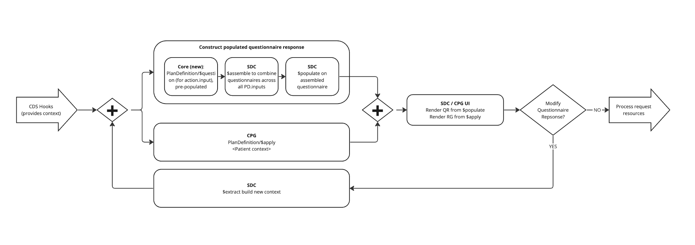

# PlanDefinition $apply with questionnaire generation

Questionnaire generation may be enabled for PlanDefinition/$apply to elicit user feedback on required data elements. Propose a process where

1. For each PlanDefinition with action.input, call [StructureDefinition/$questionnaire](https://hl7.org/fhir/R4/structuredefinition-operation-questionnaire.html) in minimal mode

2. Build a modular questionnaire with sub-questionnaires for each questionnaire generated in Step 1. Call [Questionnaire/$assemble](https://hl7.org/fhir/uv/sdc/OperationDefinition-Questionnaire-assemble.html) to produce a single questionnaire with contained sub-questionnaires

3. To build a pre-populated QuestionnaireResponse containing the Questionnaire from Step 2, call [Questionnaire/$populate](https://hl7.org/fhir/uv/sdc/OperationDefinition-Questionnaire-populate.html)

4. Pause for user input to either

   1. Change the QuestionnaireResponse and proceed to Steps 3 and 4; Or

   2. Select recommendations from the RequestGroup and end the apply cycle

5. If the QuestionnaireResponse is updated, call [QuestionnaireResponse/$extract](https://hl7.org/fhir/uv/sdc/OperationDefinition-QuestionnaireResponse-extract.html) to create new resources based on QuestionnaireResponse from Steps 3 and 4

6. If there are new resources from Step 5, pass to the context and call [PlanDefinition/$apply](https://build.fhir.org/ig/HL7/cqf-recommendations/OperationDefinition-cpg-plandefinition-apply.html). The cycle repeats.

****

## PlanDefinition/$apply

Propose this process be wrapped into $apply based on heuristics. Where there is PlanDefinition.action.input, build the Questionnaire and QuestionnaireResponse dynamically.

## StructureDefinition/$questionnaire

See [core $questionnaire operation](https://hl7.org/fhir/R4/structuredefinition-operation-questionnaire.html)

Propose parameter "minimal" where:

Elements from the structure definition should be processed to questionnaire items if:

1. The element is a part of the differential;
2. The element is a part of the snapshot and has a cardinality of at least 1..\* (min >1). Nested child elements with min > 1 should also be included if parent has min > 1;
3. The element is not fixed[x] or pattern[x]

Optionally, the parameter "supportedOnly" may be supplied. If true, the above applies only to elements with must support flags.

The goal of minimal mode is to process only the elements required for definition based extraction.

| elementDefinition                                     | questionnaireItem                                                      | notes                                                                                                                                                             |
| ----------------------------------------------------- | ---------------------------------------------------------------------- | ----------------------------------------------------------------------------------------------------------------------------------------------------------------- |
| extension[sdc-questionnaire-definitionExtractValue]   | sets extension[sdc-questionnaire-definitionExtractValue] on group item | Authored on case feature elements that will be evaluated as an expression during $extract                                                                         |
| CPG featureExpression                                 | sets [questionnaire-initialExpression]                                 | see [Conformance with expression based population and definition based extraction](#conformance-with-expression-based-population-and-definition-based-extraction) |
| {structureDefinition.url}#{element.path}              | definition                                                             | for choice type paths, replace [x] with element type.code[0]                                                                                                      |
| short description; element label; or stringified path | text                                                                   |                                                                                                                                                                   |
| type                                                  | type                                                                   | see [ElementDefinition Mappings](#mapping-elementdefinition-data-types-to-questionnaire-items)                                                                    |
| min > 0                                               | required                                                               |                                                                                                                                                                   |
| max > 1                                               | repeats                                                                |                                                                                                                                                                   |
| maxLength                                             | maxLength                                                              | apply if type = string                                                                                                                                            |
| binding.valueSet                                      | expanded valueSet used as answerOption, set type as 'choice'           |                                                                                                                                                                   |
| ??                                                    | readOnly                                                               |                                                                                                                                                                   |

Process elements from the structure definition resource:

<!-- - Set one top level group item for the questionnaire

  - Include the [SDC definition extract extension](http://hl7.org/fhir/uv/sdc/StructureDefinition/sdc-questionnaire-definitionExtract). Set extension[definition].valueCanonical to the canonical of the SD

  - If CPG case featureExpression is present, include the [SDC item population context extension](http://hl7.org/fhir/uv/sdc/StructureDefinition/sdc-questionnaire-itemPopulationContext) -->

* For each element to process

  - If the element has the [SDC definition extract value extension](https://build.fhir.org/ig/HL7/sdc/StructureDefinition-sdc-questionnaire-definitionExtractValue.html), carry the extension over to the root item with type 'group'
  - Otherwise, if the element represents the value of the case feature (e.g should be displayed for input), process new child item as follows
    - If CPG case featureExpression is present, set the [SDC initial expression extension](http://hl7.org/fhir/uv/sdc/StructureDefinition/sdc-questionnaire-initialExpression). See [Conformance with expression based population and definition based extraction](#conformance-with-expression-based-population-and-definition-based-extraction)
    - QuestionnaireItem.linkId => generate some unique id
    - QuestionnaireItem.definition => "{structureDefinition.url}#{full element path}", where:
      - "full element path" is path unless the path is a choice type (e.g. 'Observation.value[x]')
      - "full element path" is path with `[x]` replaced with the first (and only) type.code
    - QuestionnaireItem.code => Not used
    - QuestionnaireItem.prefix => Not used
    - QuestionnaireItem.text in order of preference =>
      - Element short description;
      - Element label; or
      - "Stringify" the path
    - QuestionnaireItem.type (should always be primitive type) =>
      - If the element type is specified in the differential, map to Questionnaire.type
      - If the element type is not specified in the differential, use the snapshot type and map to Questionnaire.type
      - If type code, treat as a coding with type 'choice' (note: during $extract need to map this type back to code)
      - For a more detailed mapping of primitive and complex data types, see [ElementDefinition Mappings](#mapping-elementdefinition-data-types-to-questionnaire-items)
    - QuestionnaireItem.required => if (element.min > 0)
    - QuestionnaireItem.repeats => if (element.max > 1)
    - QuestionnaireItem.readOnly => Context from the corresponding data-requirement or default[x] (???)
    - QuestionnaireItem.maxLength => element.maxLength (if type is a string)
    - QuestionnaireItem.answerOption => expanded value set binding <!-- How should example binding be handled? open choice? -->
    <!-- to do: how to handle [questionnaire-unit](http://hl7.org/fhir/R4/extension-questionnaire-unit.html)-->
    <!-- to do: how to handle sliced elements-->

### Conformance with expression based population and definition based extraction

See [SDC expression based population](https://build.fhir.org/ig/HL7/sdc/populate.html#expression-based-population) and [SDC definition based extraction](https://build.fhir.org/ig/HL7/sdc/extraction.html#definition-extract)

To conform to $populate and \$extract:

- At the root of the questionnaire, include extension [questionnaire-launchContext](https://hl7.org/fhir/uv/sdc/StructureDefinition-sdc-questionnaire-launchContext.html)  for the in context subject (most often Patient), encounter, etc

- At the root item with type 'group'

  - Include the [SDC definition extract extension](http://hl7.org/fhir/uv/sdc/StructureDefinition/sdc-questionnaire-definitionExtract). Set extension[definition].valueCanonical to the canonical of the SD;

  - If CPG featureExpression is present on the SD

    - Include the [SDC item population context extension](http://hl7.org/fhir/uv/sdc/StructureDefinition/sdc-questionnaire-itemPopulationContext);

    - For each child item, include the [questionnaire-initialExpression](https://hl7.org/fhir/uv/sdc/StructureDefinition-sdc-questionnaire-initialExpression.html) extension

### Mapping ElementDefinition data types to Questionnaire Items

- See mappings of FHIR primitive types to QuestionnaireItem.initialValue[x] and QuestionnaireItem.type [here](https://docs.google.com/spreadsheets/d/1YmmW28fDX0VsSlQAVsK2p9bbkV3hxhxnUaUCiRKAL6M/edit?usp=sharing)
- For non-primitive, complex data types, $questionnaire should be applied to the SD of the data type and returned as a subgroup of questionnaire items
- See `./rangeQuestionnaireRepresentation` as an example questionnaire.item representation of the Range data type [Datatypes - FHIR v5.0.0](https://www.hl7.org/fhir/datatypes.html#Range)

## Questionnaire/$assemble

See [SDC modular questionnaires](https://build.fhir.org/ig/HL7/sdc/modular.html#modular) for assembly details.

Multiple questionnaires may be generated if there is more than one PlanDefinition.action.input. These can be combined into a modular questionnaire which can then be assembled to create a single questionnaire. To conform with $assemble

- Create a modular questionnaire with extension [assemble-expectation](https://build.fhir.org/ig/HL7/sdc/StructureDefinition-sdc-questionnaire-assemble-expectation.html) set to code "assemble-root"

- For each questionnaire generated from PlanDefinition.action.input, add the [subQuestionnaire](https://build.fhir.org/ig/HL7/sdc/StructureDefinition-sdc-questionnaire-subQuestionnaire.html) extension

## Questionnaire/$populate

See [SDC expression based population](https://build.fhir.org/ig/HL7/sdc/populate.html#expression-based-population) for population details.

A pre-populated questionnaire response can be generated using the resulting questionnaire items. Item initial value or initial expression is used to set the answer value.

| questionnaireItem               | questionnaireResponseItem | notes                                           |
| ------------------------------- | ------------------------- | ----------------------------------------------- |
| initial.value[x]                | answer.value[x]           | Set by fixed[x], pattern[x], default[x] from SD |
| questionnaire-initialExpression | answer.value[x]           | Set by CPG featureExpression from SD            |

## QuestionnaireResponse/$extract

See [SDC definition based extraction](https://build.fhir.org/ig/HL7/sdc/extraction.html#definition-extract) for extraction details.

An extracted resource is created using the QuestionnaireResponse and corresponding Questionnaire. The extracted resource will not be persisted but used as a part of the \$apply context.

If an observation, set Observation.derivedFrom to the canonical of the QuestionnaireResponse.